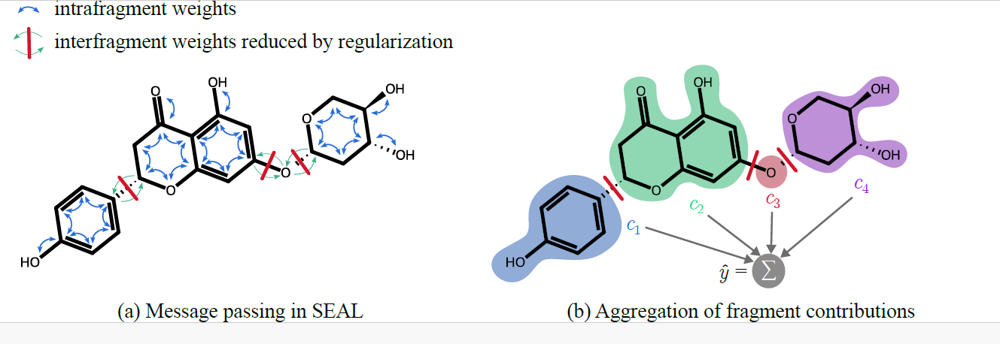

# SEAL

The official repository of "Fragment-Wise Interpretability in Graph Neural Networks via Molecule Decomposition and Contribution Analysis".

## Overview

SEAL (Substructure Explanation via Attribution Learning), a new interpretable graph neural network that attributes model predictions to meaningful molecular subgraphs. SEAL decomposes input graphs into chemically relevant fragments and estimates their causal influence on the output. The strong alignment between fragment contributions and model predictions is achieved by explicitly reducing inter-fragment message passing in our proposed model architecture.




## Installation

1. Clone the repository:
	```sh
	git clone https://github.com/gmum/SEAL.git
	cd SEAL
	```
2. Install dependencies:
	```sh
	pip install -r requirements.txt
	```
3. Install SEAL package in editable mode:
	```sh
	pip install -e .
	```

## Usage

### Training

```sh
python train.py --data-set <dataset> --task <classification|regression> --epochs <num_epochs> [other options]
```


### Extract Explanations

```sh
python scripts/extract_explanations.py --explainer_path <model_checkpoint> --save_path <output_file>
```

### Evaluate Explanations

```sh
python scripts/evaluate_explanations.py --explanations_path <explanations_file> --save_path <results_csv>
```

### Visualize Explanations

```sh
python scripts/visualize_explanations.py --explanations_path <explanations_file> --indices 0 1 2 ...
```


## Datasets

Supported datasets include both synthetic and real molecular datasets. The dataset used in this project is from TDC (https://tdcommons.ai/). It contains chemical compounds and their properties, which will be used to train and evaluate the GNN model. The dataset is divided into training, validation, and test sets. The data is stored in the data directory. You can specify the type of dataset using the `--data-set` argument.

Synthetic datasets and guidance how to download, see: https://github.com/mproszewska/B-XAIC You have to download them and put them in the data/ directory.
Example:
- data/data.csv
- data/explanations.sdf 


## License

See `LICENSE` for details.
